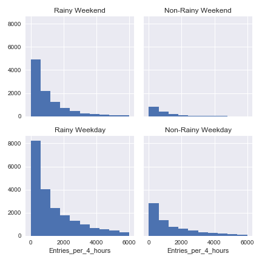
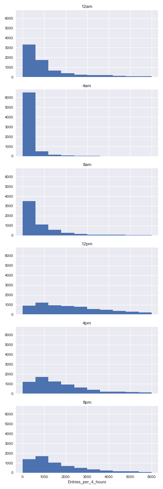
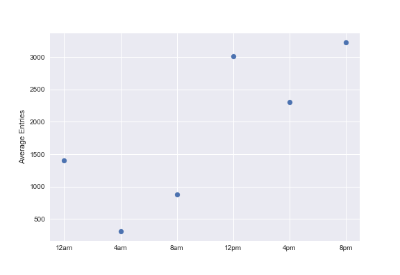
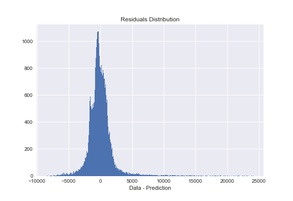

# Udacity Introduction to Data Science Final Project
## New York Subway Ridership Analysis
Analyzed the New York Subway Ridership for May, 2011. 
The analysis includes statisitical tests examing several hypothesis. 
Resutls assist feature selection for modeling a linear regression model that predicts ridership. 

## Detail Analysis
Analysis workflow detail and final linear regression model can be found in [this jupyter notebook](NewYorkSubwayAnalysis.ipynb).

## Examples
 

